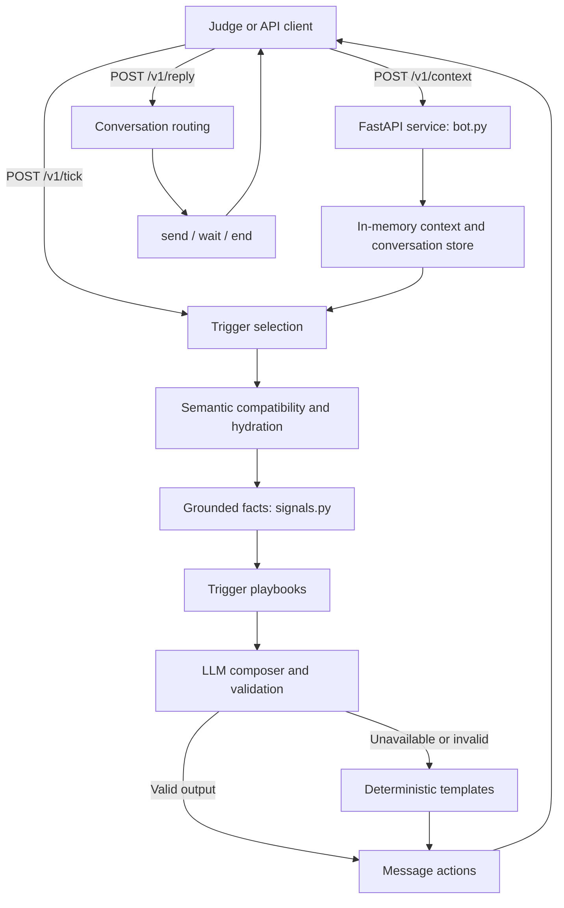

# Vera Message Engine

FastAPI service for the magicpin AI challenge. It composes merchant-facing or customer-facing messages from category, merchant, trigger, and optional customer context, and exposes the challenge API under `/v1`.

## Contents

- [Architecture](#architecture)
- [Quick Start](#quick-start)
- [Configuration](#configuration)
- [API](#api)
- [Tests and Submission](#tests-and-submission)
- [Deployment](#deployment)
- [Judge Simulator](#judge-simulator)
- [Project Layout](#project-layout)

## Architecture



The composer grounds copy in the supplied contexts, selects a playbook by trigger kind, and validates the result. Groq is optional: without an API key, or when an LLM call fails, deterministic templates provide the fallback. The context and conversation store is in memory and is cleared when the service restarts.

## Quick Start

PowerShell, from the repository root:

```powershell
python -m venv .venv
.\.venv\Scripts\Activate.ps1
python -m pip install -r requirements.txt
if (-not (Test-Path .env)) { Copy-Item .env.example .env }
```

Edit `.env` if you want LLM composition; set `LLM_API_KEY` to a Groq key and replace the example contact email. The key is optional for local template-only operation. Do not commit `.env` or expose API keys.

Start the API:

```powershell
python -m uvicorn bot:app --host 127.0.0.1 --port 8080
```

Keep that terminal running. Open [http://127.0.0.1:8080/docs](http://127.0.0.1:8080/docs) for interactive API docs. Check health at [http://127.0.0.1:8080/v1/healthz](http://127.0.0.1:8080/v1/healthz). `127.0.0.1` is local-only; a judge needs a deployed or tunneled public HTTPS URL.

## Configuration

| Variable | Purpose |
|---|---|
| `LLM_API_KEY` | Groq credential; omit to force template fallbacks |
| `LLM_PROVIDER` | Provider name; defaults to `groq` |
| `LLM_MODEL`, `LLM_FALLBACK_MODEL` | Primary and fallback model IDs |
| `LLM_SEED` | Reproducibility seed |
| `LLM_TIMEOUT_SECONDS` | Per-call timeout |
| `BOT_TEAM_NAME`, `BOT_TEAM_MEMBERS` | Identity returned by `/v1/metadata` |
| `BOT_MODEL`, `BOT_APPROACH`, `BOT_CONTACT_EMAIL`, `BOT_VERSION` | Submission metadata |
| `BOT_SUBMITTED_AT` | Optional ISO-8601 submission timestamp |
| `PORT` | Server port; injected by Render, defaults to `8080` in Docker |

See `.env.example` for the full local template. Render secrets belong in the service dashboard, not `render.yaml`.

## API

| Method | Endpoint | Purpose |
|---|---|---|
| `GET` | `/v1/healthz` | Liveness, uptime, and stored context counts |
| `GET` | `/v1/metadata` | Team, model, approach, version, and contact |
| `POST` | `/v1/context` | Store a versioned category, merchant, customer, or trigger context |
| `POST` | `/v1/tick` | Compose up to 20 actions for the supplied active trigger IDs |
| `POST` | `/v1/reply` | Route a merchant/customer reply to `send`, `wait`, or `end` |

For a tick to produce an action, POST the related category, merchant, and trigger first. The trigger's `merchant_id` and the merchant's `category_slug` must match stored context IDs. Unknown, expired, or suppressed triggers can correctly yield an empty `actions` list. Health counts are stored records, not the number of dataset files; contexts are not loaded automatically.

Context updates are idempotent by `(context_id, version)`. A higher version replaces the prior context; stale versions are rejected. The service uses an in-memory store, so repush contexts after a restart.

## Tests and Submission

Run unit tests:

```powershell
python -m pytest -q
```

Run the HTTP smoke checks with the API running in another terminal:

```powershell
.\scripts\smoke.ps1
```

Generate the deterministic 30-case submission artifact:

```powershell
python scripts/expand_dataset.py
python scripts/build_submission.py
(Get-Content .\submission.jsonl).Count
```

The expansion step writes the generated data under `expanded/`; the builder writes or replaces root-level `submission.jsonl`. It uses `compose_message(..., use_llm=False)`, so it does not require a key and is reproducible. The file must contain one UTF-8 JSON object per canonical test pair, with `test_id`, `body`, `cta`, `send_as`, `suppression_key`, and `rationale` fields.

The bulk API probe is optional. It seeds the representative source dataset and sends synthetic tick requests; its default is 80 runs and can use the server's LLM key. For seed-only loading without ticks, use `python scripts/bulk_probe.py --runs 0 --honor-links`.

## Deployment

The repository includes a Dockerfile and Render Blueprint (`render.yaml`). To deploy:

1. Push the repository to GitHub and create a Render Blueprint from it.
2. Set `LLM_API_KEY` as a secret in Render. Set a real `BOT_CONTACT_EMAIL` and confirm the `BOT_TEAM_*` values.
3. Wait for the service to deploy and pass its `/v1/healthz` health check.
4. Use the public HTTPS base URL shown by Render as the judge URL; do not submit `localhost` or the `/docs` path as the API base.

The free tier may cold-start after inactivity. The service uses an in-memory store, so it is not durable across restarts or suitable for multiple independent replicas without a shared store.

## Judge Simulator

`judge_simulator.py` is an optional LLM-based integration evaluator. Set `BOT_URL` and its provider, model, and evaluator API key in the script's configuration section. This evaluator credential is separate from the bot's `LLM_API_KEY`. Run it with:

```powershell
python judge_simulator.py
```

## Project Layout

| File | Responsibility |
|---|---|
| `bot.py` | FastAPI routes and request handling |
| `composer.py` | LLM composition, validation, and fallback selection |
| `templates.py` | Deterministic message templates |
| `signals.py` | Grounded facts and validation helpers |
| `playbooks.py` | Trigger-kind routing and CTA defaults |
| `semantic_compat.py`, `hydration.py` | Category compatibility and null-safe context handling |
| `conversation.py` | Reply, intent, auto-reply, and opt-out handling |
| `state.py` | In-memory contexts, conversation state, and deduplication |
| `llm_provider.py` | LLM provider adapters |
| `dataset/`, `expanded/` | Seed and generated challenge contexts |
| `scripts/` | Dataset, submission, smoke, and probe utilities |
| `tests/` | Unit tests |

The dataset is synthetic and intended only for the magicpin challenge, not real merchant outreach.
